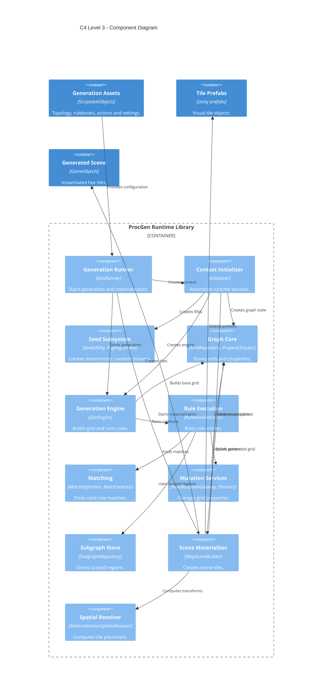

```mermaid
C4Component
title C4 Level 3 - Component Diagram

Container_Boundary(runtime, "ProcGen Runtime Library") {
  Component(runner, "Generation Runner", "GenRunner", "Starts generation and materialization.")
  Component(initializer, "Context Initializer", "Initializer", "Assembles runtime services.")
  Component(seed, "Seed Subsystem", "SeedUtility, PcgRngStream", "Creates deterministic random streams.")
  Component(graph, "Graph Core", "GridRepository, PropertyTracker", "Stores cells and properties.")
  Component(engine, "Generation Engine", "GenEngine", "Builds grid and runs rules.")
  Component(rules, "Rule Execution", "RulebookExecutor", "Runs rule entries.")
  Component(match, "Matching", "MatchDefinition, MatchSelector", "Finds valid rule matches.")
  Component(mutation, "Mutation Services", "RuleMutationGateway, Painters", "Changes grid properties.")
  Component(subgraphs, "Subgraph Store", "SubgraphRepository", "Stores scoped regions.")
  Component(materializer, "Scene Materializer", "MapSceneBuilder", "Creates scene tiles.")
  Component(spatial, "Spatial Resolver", "MaterializationSpatialResolver", "Computes tile placement.")
}

Container(configAssets, "Generation Assets", "ScriptableObjects", "Topology, rulebooks, actions and settings.")
Container(prefabs, "Tile Prefabs", "Unity prefabs", "Visual tile objects.")
Container(scene, "Generated Scene", "GameObjects", "Instantiated hex tiles.")

Rel(configAssets, runner, "Provides configuration")
Rel(runner, initializer, "Creates context")
Rel(initializer, seed, "Creates RNG")
Rel(initializer, graph, "Creates graph state")
Rel(initializer, engine, "Creates engine")
Rel(initializer, materializer, "Creates materializer")

Rel(runner, engine, "Starts generation")
Rel(engine, graph, "Builds base grid")
Rel(engine, rules, "Runs rulebook")
Rel(rules, match, "Finds matches")
Rel(rules, mutation, "Applies actions")
Rel(rules, subgraphs, "Uses scoped regions")
Rel(mutation, graph, "Updates properties")

Rel(runner, materializer, "Starts materialization")
Rel(materializer, graph, "Reads generated grid")
Rel(materializer, spatial, "Computes transforms")
Rel(materializer, prefabs, "Selects prefabs")
Rel(materializer, scene, "Creates tiles")

UpdateLayoutConfig($c4ShapeInRow="3", $c4BoundaryInRow="1")
```