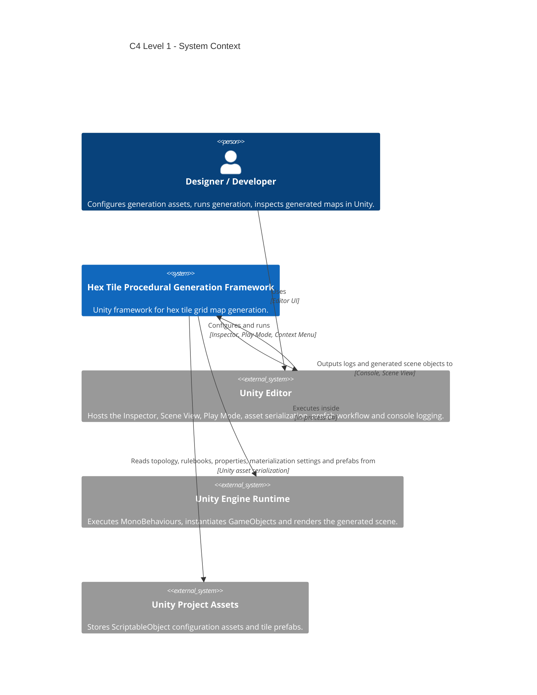

```mermaid
C4Context
title C4 Level 1 - System Context

Person(designer, "Designer / Developer", "Configures generation assets, runs generation, inspects generated maps in Unity.")

System(procgen, "Hex Tile Procedural Generation Framework", "Unity framework for hex tile grid map generation.")

System_Ext(unityEditor, "Unity Editor", "Hosts the Inspector, Scene View, Play Mode, asset serialization, prefab workflow and console logging.")
System_Ext(unityEngine, "Unity Engine Runtime", "Executes MonoBehaviours, instantiates GameObjects and renders the generated scene.")
System_Ext(assetData, "Unity Project Assets", "Stores ScriptableObject configuration assets and tile prefabs.")

Rel(designer, unityEditor, "Uses", "Editor UI")
Rel(unityEditor, procgen, "Configures and runs", "Inspector, Play Mode, Context Menu")
Rel(procgen, unityEngine, "Executes inside", "In-process C#")
Rel(procgen, assetData, "Reads topology, rulebooks, properties, materialization settings and prefabs from", "Unity asset serialization")
Rel(procgen, unityEditor, "Outputs logs and generated scene objects to", "Console, Scene View")

UpdateLayoutConfig($c4ShapeInRow="2", $c4BoundaryInRow="1")

UpdateRelStyle(unityEditor, procgen, $offsetX="-90", $offsetY="-35")
UpdateRelStyle(procgen, unityEditor, $offsetX="110", $offsetY="35")
UpdateRelStyle(procgen, assetData, $offsetX="-120", $offsetY="20")
UpdateRelStyle(procgen, unityEngine, $offsetX="120", $offsetY="20")
```