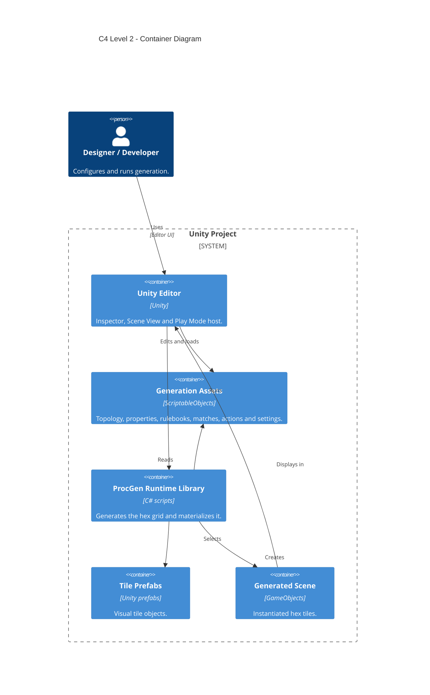

```mermaid
C4Container
title C4 Level 2 - Container Diagram

Person(designer, "Designer / Developer", "Configures and runs generation.")

System_Boundary(system, "Unity Project") {
  Container(editor, "Unity Editor", "Unity", "Inspector, Scene View and Play Mode host.")
  Container(configAssets, "Generation Assets", "ScriptableObjects", "Topology, properties, rulebooks, matches, actions and settings.")
  Container(runtime, "ProcGen Runtime Library", "C# scripts", "Generates the hex grid and materializes it.")
  Container(prefabs, "Tile Prefabs", "Unity prefabs", "Visual tile objects.")
  Container(scene, "Generated Scene", "GameObjects", "Instantiated hex tiles.")
}

Rel(designer, editor, "Uses", "Editor UI")
Rel(editor, configAssets, "Edits and loads")
Rel(editor, runtime, "Runs")
Rel(runtime, configAssets, "Reads")
Rel(runtime, prefabs, "Selects")
Rel(runtime, scene, "Creates")
Rel(scene, editor, "Displays in")

UpdateLayoutConfig($c4ShapeInRow="2", $c4BoundaryInRow="1")

UpdateRelStyle(editor, configAssets, $offsetX="-80", $offsetY="-20")
UpdateRelStyle(editor, runtime, $offsetX="90", $offsetY="-20")
UpdateRelStyle(runtime, configAssets, $offsetX="-90", $offsetY="25")
UpdateRelStyle(runtime, prefabs, $offsetX="80", $offsetY="-15")
UpdateRelStyle(runtime, scene, $offsetX="80", $offsetY="25")
UpdateRelStyle(scene, editor, $offsetX="110", $offsetY="35")
```